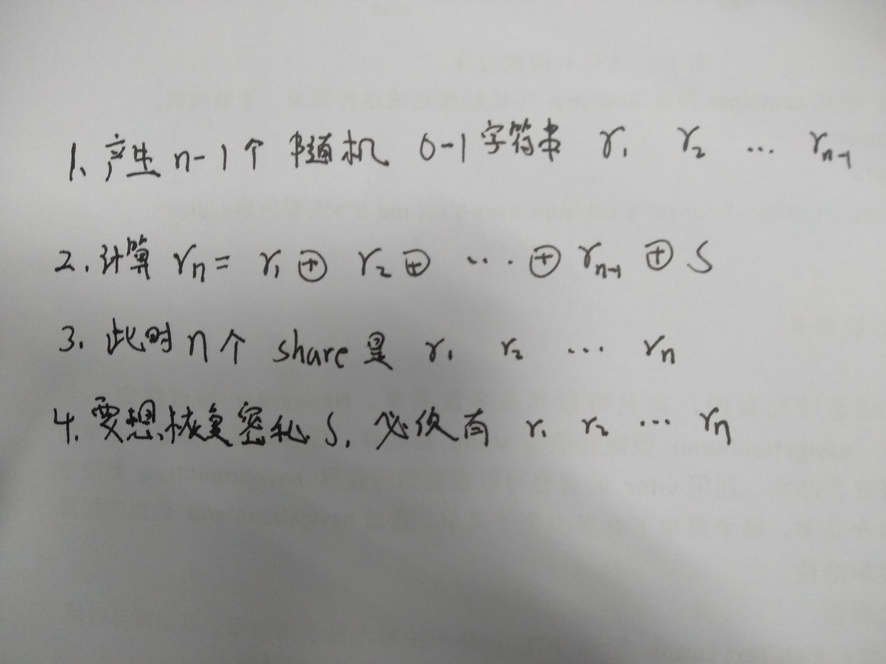
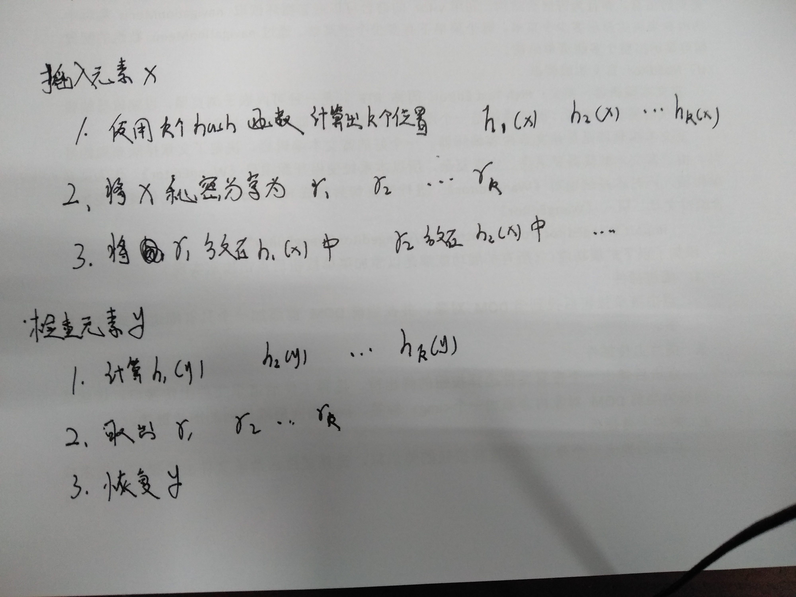

# 布隆过滤器的参数设置

参数设置可以参考如下的网址： http://pages.cs.wisc.edu/~cao/papers/summary-cache/node8.html


# BloomFilter.java

```java
List<String> keywords = GenerateBloomFilter.getKeywordsFromFile(inputAbsolutePath);
BloomFilter<String> bf = new BloomFilter<String>(0.01,keywords.size()+20);
bf.addAll(keywords);
```

```java
bf.contains("test")
bf.contains(keys) //只要包含集合中的一个元素即可
bf.containsAll() //需要包含集合中的所有的元素
```

# 号称是JAVA实现的最快的Bloom Filter

* 官网是 https://alexandrnikitin.github.io/blog/bloom-filter-for-scala/ ,在自己的官网中，他分析了Google的Guava、Twitter的Algebird、ScalaNLP的Breeze有多么的suck


* 其github网址为https://github.com/alexandrnikitin/bloom-filter-scala


* 可以使用maven引入其依赖https://mvnrepository.com/artifact/com.github.alexandrnikitin/bloom-filter_2.11 ，最新的版本为


```xml
<!-- https://mvnrepository.com/artifact/com.github.alexandrnikitin/bloom-filter -->
<dependency>
    <groupId>com.github.alexandrnikitin</groupId>
    <artifactId>bloom-filter_2.11</artifactId>
    <version>0.10.1</version>
</dependency>
```

* 用法 它是在Scala下的一个库，但是在java上也能使用，就是用法有点丑
```scala
import bloomfilter.mutable.BloomFilter

val expectedElements = 1000
val falsePositiveRate = 0.1
val bf = BloomFilter[String](expectedElements, falsePositiveRate)
bf.add("some string")
bf.mightContain("some string")
bf.dispose()
```
```java
import bloomfilter.CanGenerateHashFrom;
import bloomfilter.mutable.BloomFilter;

long expectedElements = 10000000;
double falsePositiveRate = 0.1;
BloomFilter<byte[]> bf = BloomFilter.apply(
        expectedElements,
        falsePositiveRate,
        CanGenerateHashFrom.CanGenerateHashFromByteArray$.MODULE$);

byte[] element = new byte[100];
bf.add(element);
bf.mightContain(element);
bf.dispose();
```
* 效率： 这个库真的很强大，测试了1000 W条数据、0.1的误判率，序列化之后只有区区5.8M。真的很棒！


## 计数型BloomFilter

https://github.com/Baqend/Orestes-Bloomfilter

支持计数型BF 和 redis的BF

```xml
<dependencies>
   <dependency>
       <groupId>com.baqend</groupId>
       <artifactId>bloom-filter</artifactId>
       <version>1.0.7</version>
   </dependency>
</dependencies>
<repositories>
   <repository>
       <snapshots>
        <enabled>false</enabled>
       </snapshots>
       <id>central</id>
       <name>bintray</name>
       <url>http://jcenter.bintray.com</url>
   </repository>
</repositories>
```

# Garbled BloomFilter

参考文献： When Private Set Intersection Meets Big Data An Efficient and Scalable Protocol

### 秘密共享

当t=n时，（t,n）秘密共享方案如下：


### Garbled BF构造

